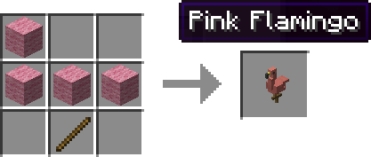

Flamingo
========

Flamingo Minecraft mod for [Fabric](http://fabricmc.net/). Adds a Pink Flamingo.

## Downloads

Downloads can be found [here](https://github.com/copygirl/Flamingo/releases).

You can get the old Forge releases [here](https://github.com/Vexatos/Flamingo/releases).

## Usage

- Craft
- Place
- Punch
- Enjoy

## Credits

- Suggested by and dedicated to [Reddit](https://www.reddit.com/r/Minecraft/comments/193y2o/is_there_a_mod_that_allows_pink_flamingos_like/c8krbz6/)
- Inspired by [Dig Build Live: Episode 3](https://youtu.be/Q9cON8Xue88)
- Translators: [3TUSK](https://github.com/3TUSK) (CN), [Adaptivity](https://github.com/Adaptivity) (RU), [Vexatos](https://github.com/Vexatos) (DE)
- Contributers: [asiekierka](https://github.com/asiekierka), [GirafiStudios](https://github.com/GirafiStudios), [iTitus](https://github.com/iTitus), [Vexatos](https://github.com/Vexatos)
- Originally developed by copygirl for Forge, then later updated to Fabric
- Special thanks to Vexatos and asiekierka for keeping the mod alive ♥
